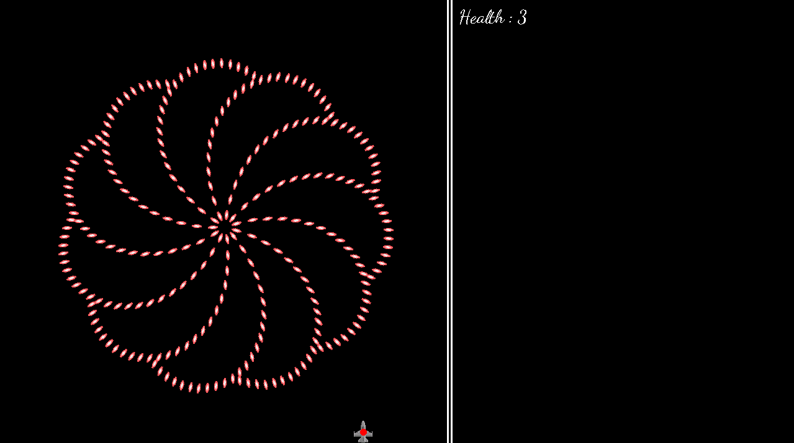

# Bullet-Hell
Simple Bullet Hell game (I didn't name yet) that I develop using c++ and SDL2. For now this is just an experiment but later I might turn it into a complete game.

# How to compile
On Ubuntu you need to run compile.py and it will create executable named "BulletHell". Note: you need to have g++ and SDL2 development libraries installed.

Unfortunately there is no easy way to compile project for Windows or macOS yet.

# Credits

All sprites are taken from <a href="https://opengameart.org/content/bullet-collection-2-m484-games">here</a>.
SDL_Setup and Sprite files are taken from <a href="https://www.youtube.com/watch?v=b1BLuYorzX0&list=PLHM_A02NtaaVey-4Ezh7p6bbOsv-DKA-0">here</a>.
